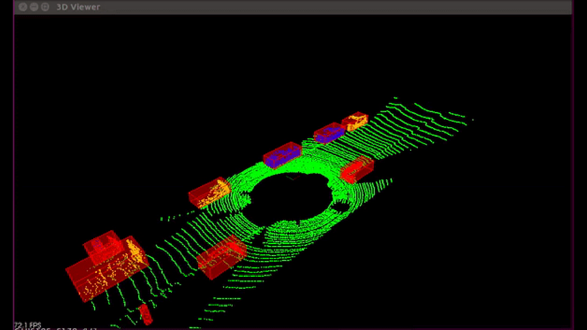
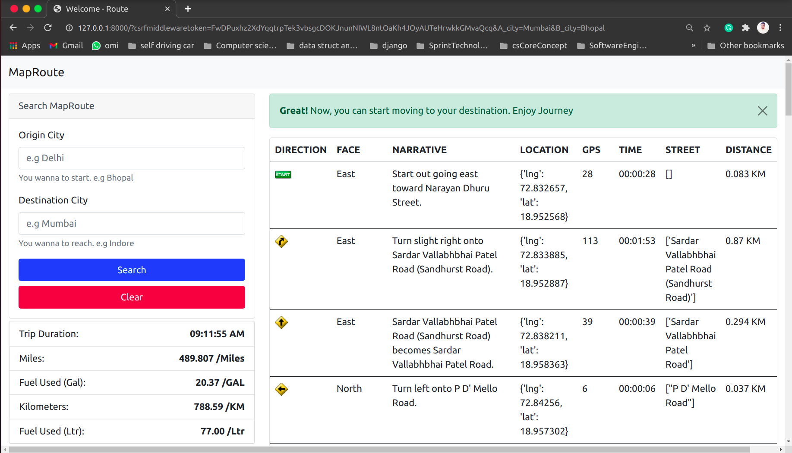
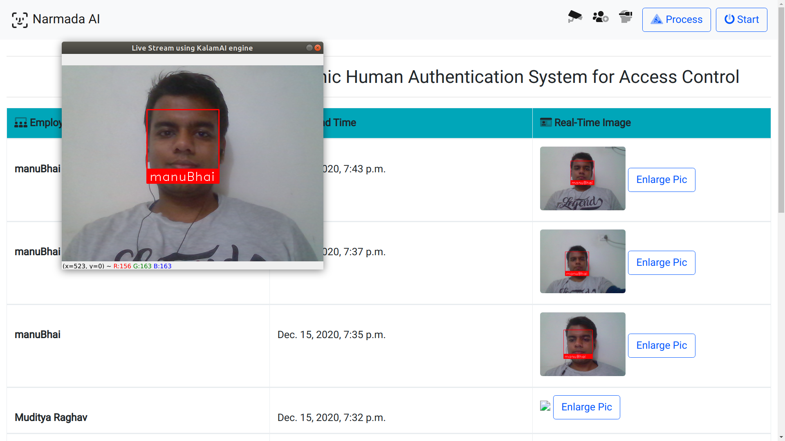

# Project Readme

## Introduction - Muditya Raghav Resume | Projects | Patent

This repository contains files related to a system for detecting persons and their activities, along with a resume.

## Files

### Images
1. 
2. 
3. 
4. 
5. 

### PDFs
1. [Patent No.202221006680 A SYSTEM TO DETECT PERSON AND THEIR ACTIVITIES.pdf](Patent%20No.202221006680%20A%20SYSTEM%20TO%20DETECT%20PERSON%20AND%20THEIR%20ACTIVITIES.pdf)
2. [ResumeMudityaRaghav.pdf](ResumeMudityaRaghav.pdf)

## Usage

Feel free to explore the images and PDFs in the root directory. The PDFs contain important information about the system and a resume.

## License

This project is licensed under [MIT License](LICENSE).
